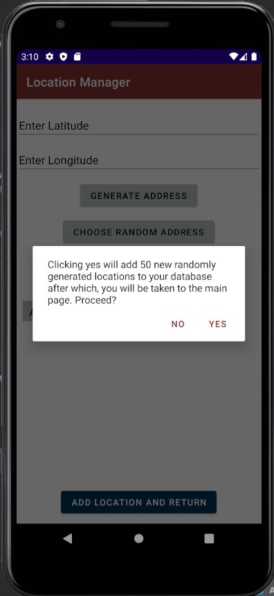
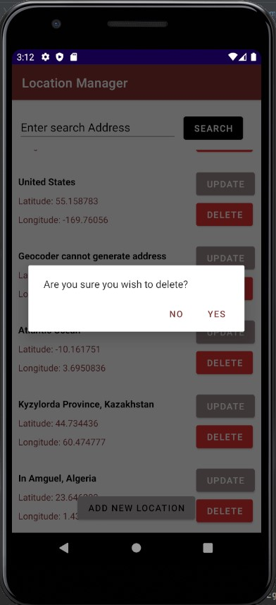

# Location Manager Application:

**Student Name:** Tegveer Singh\
**Student ID:** 100730432

## Features:

1. This application stores the locations provided to it in its database
2. Locations can be added, updated, searched and deleted
3. Application uses geocoding to generate address for certain latitude and longitude
4. The application contains appropriate validation in case correct inputs are not provided/geocoding is not successful
5. App testing has been performed on different emulators and more than 100 different locations

## Helpful Tips and Instructions:
1. When providing Latitude and Longitude for reverse geocoding/ when adding random locations, make sure to keep track of the displayed toasts, since **reverse geocoding** is not successful for some inaccessible locations
2. Click on the **add 10 random locations button** the add activity page to test the functionality of the application with some random address values
3. A single random address can also be generated using the **choose random address button**
4. Note that the **Update page** does not validate the information. This is because it's supposed to provide complete customization access to the user
5. The **delete** and **search** funtoinalities work the usual way

## Screenshots:
Following are some screenshots of the running application from Pixel 3a Emulator Window

  
  
  
  
  
  

