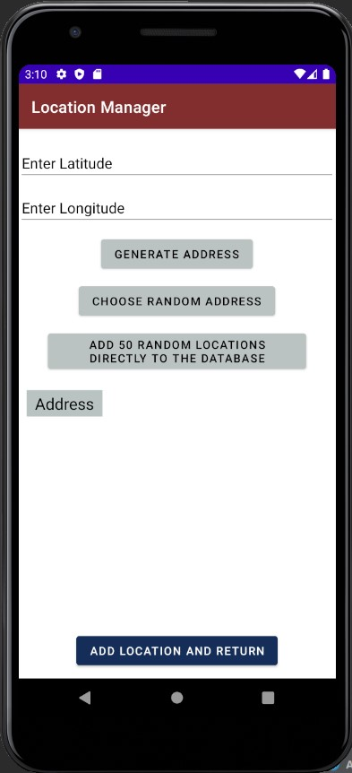

# Location Manager Application:

**Student Name:** Tegveer Singh\
**Student ID:** 100730432

## Features:

1. This application stores the locations provided to it in its database
2. Locations can be added, updated, searched and deleted
3. Application uses geocoding to generate address for certain latitude and longitude
4. The application contains appropriate validation in case correct inputs are not provided/geocoding is not successful
5. App testing has been performed on different emulators and more than 100 different locations

## Screenshots:
Following are some screenshots of the running application from Pixel 3a Emulator Window

  
  
  
  

